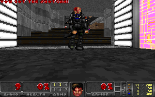

# PLAYPAL to RGB converter



The purpose of this tool is to convert raw [PLAYPAL](https://doomwiki.org/wiki/PLAYPAL) files into raw RGB files.
These raw RGB files can then be converted into PNG files with tools like [ImageMagick](https://imagemagick.org/).

## Compilation

```sh
make
```

## Usage

The tool takes the path of a palette file as argument, reads the image in PLAYPAL format from `stdin` and writes out the image in RGB format to `stdout`.
This output can be piped to the `convert` tool from ImageMagick to produce an output file in PNG format.

```sh
./playpal2rgb palette.raw < framebuffer.raw | convert -depth 8 -size 320x200 rgb:- framebuffer.png
```
